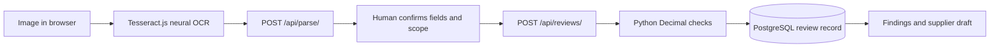

# How the backend and API work

Verified against friend's commit `3c349a8` plus the confirmation/UI patch developed on 10 October 2026. Live API tested at https://sahi-gst-d511.vercel.app. Backend/API behaviour below is actual implemented behaviour, not the larger planning roadmap.

## One request journey



1. The browser accepts a JPEG/PNG under 5 MB and at most 20 megapixels. Tesseract.js reads it locally. First use downloads OCR assets; this is not an offline guarantee.
2. OCR text goes to Django's `/api/parse/`. A regex label parser proposes fields. Missing labels remain null. It does not infer a product's legal tax rate or fill missing taxes with zero.

Parser update on `feature/invoice-extraction`: labels can be colon-separated or whitespace-separated, values may follow on the next line, currency prefixes/grouping are normalized, and tax percentages are kept distinct from monetary amounts. Explicit supplier/buyer headings can assign a bare GSTIN; a bare unscoped GSTIN stays unknown. ISO/named-month dates normalize to YYYY-MM-DD; ambiguous numeric dates stay null. Repeated conflicting values stay null. Five synthetic OCR-text layouts and additional safety regressions pass; no real-world OCR accuracy figure is claimed.
3. The person confirms fields against the original and confirms the limited invoice scope. After an edit, the updated frontend requires fresh confirmation.
4. `/api/reviews/` runs deterministic checks, stores a review and returns findings plus a correction draft. Each run is a new record; it does not overwrite the original review.
5. The frontend displays saved history, drafts and JSON exports. Copying a draft does not send it or mark an invoice resolved.

## Tools/libraries and their jobs

| Component | Tool | Job |
|---|---|---|
| Interface | Next.js 16 / React 19 / TypeScript | Responsive workspace; static production export |
| Icons | Lucide React | UI icons |
| Free extraction | Tesseract.js | Browser neural OCR, no LLM API required |
| API and web app | Django 5.2 | URLs, sessions, CSRF, requests, persistence |
| Authentication | Django Allauth | Username/password signup, login and logout; email verification currently disabled |
| Database | PostgreSQL / psycopg / dj-database-url | Durable users, sessions and JSON review records |
| Exact arithmetic | Python Decimal | Money/rate checks without binary float errors |
| Optional cloud image reading | Gemini REST API via urllib | Image-to-fields extraction, only if configured and explicitly consented |
| Image validation | Pillow | Verify cloud-upload bytes/type/dimensions |
| Static assets | WhiteNoise | Django assets locally; Vercel serves collected assets in its deployment flow |
| Deployment | Vercel Python/Django support | Root WSGI entrypoint with Next.js export included |
| Alternative server packaging | Docker / Gunicorn | Optional single-container deployment; not required for the live Vercel demo |
| Development | Codex, Git and GitHub | Implementation, focused tests, version control and collaboration |

Neon was the planned free PostgreSQL provider. The live API confirms PostgreSQL, but it does not expose the provider; confirm the actual database provider in the owner's dashboard rather than assuming it.

## Actual endpoints

All routes have a trailing slash. POST/DELETE requests require Django CSRF handling. The frontend first calls `/api/session/`, then sends the `csrftoken` cookie value in `X-CSRFToken`; cookies maintain the session.

| Method and path | Input | Output / purpose |
|---|---|---|
| GET `/api/health/` | None | Database `SELECT 1`; 200 when ready, 503 if unavailable |
| GET `/api/session/` | Session cookies | Auth state, username, cloud configuration and database type; creates guest session and clears expired guest reviews |
| POST `/api/parse/` | JSON `text`, up to 30,000 characters | Best-effort extracted `fields`, source `local_ocr` and review warning |
| GET `/api/reviews/` | Session/account | Up to 100 newest reviews belonging to that user/session |
| POST `/api/reviews/` | JSON `fields`, `source`, `scope_confirmed: true`, optional `original_id` | 201 with a newly saved review, deterministic result and draft |
| GET `/api/reviews/{uuid}/` | Session/account | Owned review and draft; another session receives 404 |
| DELETE `/api/reviews/{uuid}/` | CSRF + ownership | Deletes the owned review; does not delete other users' reviews |
| POST `/api/extract/` | Multipart `file`, `consent=true` | Optional Gemini structured fields; requires signed-in user and configured free-tier consent flag |
| `/accounts/…` | Allauth forms | Signup/login/logout with sessions and CSRF |

The old `/api/invoices/` endpoints in MVP_SPEC.md are proposed design names. They are **not implemented routes**; use this table for actual integration.

## Confirmed field schema

Text/date fields: `supplier_name`, `supplier_gstin`, `buyer_name`, `buyer_gstin`, `invoice_number`, `invoice_date` (YYYY-MM-DD), `place_of_supply`, `description`.

Numeric fields represented as strings or null: `taxable_value`, `tax_rate`, `cgst`, `sgst`, `igst`, `round_off`, `total`. Maximum field length is 500 characters. GSTIN text is uppercased and spaces removed; that normalization is not identity verification.

Example request:

```json
{
  "fields": {
    "supplier_name": "Synthetic supplier",
    "buyer_name": "Synthetic buyer",
    "invoice_number": "DEMO/001",
    "taxable_value": "10000",
    "tax_rate": "18",
    "cgst": "900",
    "sgst": "900",
    "igst": "0",
    "round_off": "0",
    "total": "12800"
  },
  "source": "sample",
  "scope_confirmed": true
}
```

Identifiers/date/description omitted above produce review findings; the total check still finds arithmetic expected `11800.00`. This is a synthetic arithmetic example, not a product-rate recommendation.

Response contains `id`, `fields`, `result`, `source`, `status`, `created_at`, `original_id`, `draft`. Result contains rule version, findings, counts, unchecked areas and overall status. Findings contain `rule_id`, field, status, title, message and observed/expected values where applicable.

## Rules and boundaries

- **F01:** named fields present; absent/unreadable fields need confirmation.
- **I01:** GSTIN character pattern only. Checksum, active registration and authenticity are not checked.
- **I02:** invoice-number character/length review within the supported context.
- **I03:** parse date and flag implausible future dates for review.
- **M00:** missing/invalid/negative numeric inputs need review; unknown is not zero.
- **M04:** taxable value + CGST + SGST + IGST + explicit round-off compared with printed total using Decimal/paise rounding.
- **M02:** single printed rate × taxable base compared with aggregate tax; different rounding or multiple rates need human review.
- **M03:** mixed IGST and CGST/SGST prompt review; no jurisdiction inference is made.

Statuses: `issue`, `review`, `pass`, `not_checked`. A review becomes `checked` when the supported checks have no issue/review findings; it is not complete GST compliance. HSN classification, legal rate, place-of-supply applicability, GSTR-2B matching, filing and ITC eligibility stay explicitly unchecked.

## Storage, ownership and revisions

`Review` stores a UUID, nullable account owner, guest session key, confirmed fields JSON, result JSON, extraction source, status, optional original-review UUID and timestamps. Users and sessions use Django/Allauth tables.

Logged-in queries filter by owner. Guest queries filter by session and a 24-hour window. Expired guest records are deleted on the next session-endpoint request, not by a precisely timed background scheduler. Account reviews persist until deleted. Guest and account histories are separate.

Source image bytes are not saved by this application. Reopening a saved review shows fields/results, not a retained original image. `original_id` links review runs; it does not prove the supplier issued a corrected document, resolve older drafts, or provide full invoice-lifecycle reconciliation.

## Optional LLM and zero-cost operation

The checked live deployment returned `cloud_extraction: false`. Its working baseline is neural OCR plus rules, not a currently running LLM.

Gemini requires server-side `GEMINI_API_KEY`, a model available to the account and `GEMINI_FREE_TIER_CONFIRMED=1`. The adapter requires login, explicit image consent, a 20-second session scan interval, file verification and a 35-second provider timeout. Failure returns an error; no paid provider is automatically selected. Model/account free quota and data terms still need owner verification before enabling it.

## Deployment fixes from the friend

Four commits (`739186f` → `3c349a8`) flattened root requirements, added pyproject metadata/entrypoint, changed vercel.json to `config/wsgi.py`, and added a root config package/WSGI shim that loads backend modules. This fixed Vercel discovery while preserving the Django implementation. `scripts/vercel_build.py` installs/builds Next.js and runs migrations.

Configuration values belong in the hosting environment: production SECRET_KEY, PostgreSQL DATABASE_URL, allowed host and HTTPS CSRF origin; DEBUG=0. Do not commit database passwords or API keys. See FREE_DEPLOYMENT.md for the original route; use the actual deployed root configuration now.

## Verification on 10 October

- Live health and session endpoints: 200; database reports PostgreSQL; cloud extraction disabled.
- Live synthetic API test: CSRF/session, parsing, review creation, expected arithmetic, draft and guest isolation passed; test record removed.
- Earlier local PostgreSQL suite: 10 tests passed. After importing deployment fixes, local SQLite smoke-test suite (10 tests), root WSGI import, TypeScript and production Next.js export passed. Current live PostgreSQL behaviour was checked separately.
- Browser local OCR was tested earlier. Real-world extraction accuracy and physical-device coverage remain unmeasured; use the manual testing list in HANDOFF.md.
