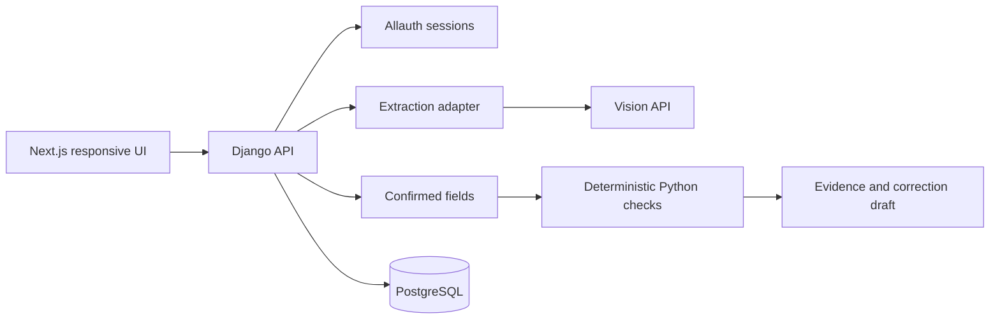

# MVP and implementation specification

Status: specification plus roadmap. A first implementation now exists; README is the source of truth for what is shipped/tested. Tax applicability beyond the limited checks still needs verification. Runtime baseline is free local neural OCR with human confirmation; Gemini is optional. See FREE_DEPLOYMENT.md.

## Scope contract

P0: one clear JPEG/PNG invoice image, ordinary domestic B2B goods invoice, explicit user-confirmed supplier state and place of supply, tax-exclusive line amounts, no cess or unusual adjustments. Start with supported state-to-state cases; flag unsupported union-territory or special tax scenarios for review until implemented. Both buyer and seller are ordinary GST-registered businesses for this scoped flow.

Document types outside P0: bill of supply, credit/debit note, export, SEZ, reverse charge, services, composition, mixed exempt/taxable supply, multiple currencies, bill-to/ship-to special cases and multipage documents. Allow upload rejection or “outside current scope” rather than misleading failed checks.

Never infer a product's legal rate from an LLM. P0 checks arithmetic against the printed/user-confirmed rate. A mathematical 18% example is not an HSN-rate recommendation.

## P0 flow and completion criteria

1. Landing/upload: “Check an invoice” plus a clearly marked synthetic sample. Short format and processing notice.
2. Upload validation: inspect bytes/type, file size and pixel limits, one image per request. Proposed cap: 5 MB plus decoded-pixel limit selected during implementation. Reject corrupt files and unsupported types cleanly.
3. AI reads fields into a strict schema. Null means unknown; no guessing missing GSTINs, HSNs or place of supply. Invoice text is data, never an instruction to the model. No external tools or actions exposed to extraction.
4. Review screen: show original plus extracted fields. Require confirmation of identifiers, date, taxable amounts, rate, tax components and place of supply. Highlight absent or uncertain values; model self-confidence is not calibrated evidence.
5. Rules return issue/review/pass/not-checked with explicit prerequisites. Arithmetic findings can operate even if legal applicability checks abstain.
6. Findings show original value, expected relationship, discrepancy and next action. No overall “legally valid” badge or opaque risk score.
7. Generate a deterministic supplier-request draft from confirmed findings. User copies it; no automatic email/WhatsApp sends. Distinguish OCR correction from supplier-document correction.
8. Supplier revision can be uploaded and linked to the original review. “Issue no longer detected in this revision” is appropriate; “GST approved” is not.

The end-to-end baseline is done only when a new supported image works through real extraction, deterministic checks and request generation on the hosted app.

## Initial check catalogue

The table is a proposed rule backlog, not a claim of legal completeness. Rule 46 is a starting reference with exceptions; verify the current consolidated text and notifications before implementing legal assertions.

| ID | Check | Result meaning / boundary | Priority |
|---|---|---|---|
| F01 | Supplier identity and invoice date/number present | Missing fields in supported tax-invoice context | P0 |
| F02 | Recipient name/address/GSTIN present in scoped registered-B2B case | Do not require buyer GSTIN for every B2C invoice | P0 |
| F03 | Line description, taxable amounts, rate and tax amounts available | Show absent/unreadable fields; unknown is not zero | P0 |
| I01 | GSTIN length/character pattern | Structural check only; not registration verification | P0 |
| I02 | Invoice number length/allowed characters | Rule 46(b) basis: up to 16 characters, permitted letters/digits/hyphen/slash; verify current rule | P0 |
| I03 | Date parses and is not implausibly future-dated | A future-date flag is review, not automatic illegality | P0 |
| M01 | Taxable line values sum to stated subtotal | Decimal arithmetic; unsupported adjustments need review | P0 |
| M02 | Printed rate × taxable base agrees with tax amount | Does not decide whether the printed rate is legally correct | P0 |
| M03 | Tax component totals agree with aggregate tax | Compare CGST/SGST/IGST as applicable; handle null separately | P0 |
| M04 | Subtotal + taxes + explicit round-off agrees with total | Report amount difference and rounding method | P0 |
| J01 | Confirmed supplier location and place of supply agree with tax type for scoped ordinary goods case | No buyer-state shortcut; exceptions/unknown context abstain | P1 after verification |
| I04 | GSTIN checksum and state code | Add only with authoritative algorithm/reference and known test vectors; still not active status | P1 |
| D01 | Possible duplicate in this workspace | Same supplier GSTIN + financial year + exact invoice number; same re-upload/revision handled separately | P1 |
| H01 | HSN presence/length | Applicability depends on context/turnover/notifications; not product-classification verification | P1 |

Defer required signature/e-signature, IRN/QR applicability, shipping details and other conditional legal fields unless their exact applicability is implemented and tested. Display them as not checked. P0 is a limited review assistant, not complete Rule 46 validation.

### Rule record

Each check has `rule_id`, version, title, severity, prerequisites, document scope, effective dates where legally applicable, source URL and retrieval date, observed values, expected relation, result, explanation and human-review requirement. Keep changes in reviewed code/config with regression tests. Do not let AI author new tax rules at runtime.

### Money and rounding

Use Python Decimal from string inputs; serialize money/rates as strings. Calculate at line and invoice levels separately. Any tolerance must be explicit and tested, not silently used to green-light differences. Proposed initial comparison uses displayed paise precision and explicit round-off fields; when rounding policy is ambiguous, show both calculations and Needs review. Do not apply a blanket rupee tolerance as a legal rule.

Example: taxable base ₹10,000, displayed CGST 9%=₹900 and SGST 9%=₹900, displayed invoice total ₹12,800. Expected arithmetic total is ₹11,800; discrepancy is ₹1,000. Label “total difference,” never “₹1,000 recovered” or “ITC saved.” This is a synthetic arithmetic illustration, not a claim about a product's tax rate.

## Screen design

Desktop: original invoice left, findings right. Phone: findings first with a persistent “View original” toggle and field editor. Use large amounts and plain-language issue labels. Make the original text/crop available before any request is copied.

Four states: red Issue found, amber Needs review, green Checked, neutral Not checked. Always pair colour with text/icon. Source highlight boxes are stretch: render only real OCR/provider coordinates; never draw invented boxes. Baseline uses page preview and field references.

Show: “3 issues to review · 6 checks completed · 4 checks not run.” Count the actual results. Keep extraction confidence, rule results, supplier response and portal status separate.

Error states: unreadable image, extraction timeout, unsupported invoice, missing fields, request in progress, upload too large, API quota exceeded, session expired and revision mismatch. Manual input fallback is explicitly labelled “entered by user.”

## Locked architecture



React is provided by Next.js; it is not a separate second frontend. Django owns extraction calls, rules, authorization and data. PostgreSQL is the persistent store. Django Allauth owns user authentication. Prefer session cookies with CSRF and a same-origin API route/proxy to reduce cross-origin complexity. Exact Allauth frontend integration must be verified against the version selected during scaffold; no ad-hoc parallel authentication system.

Use Django REST Framework if the teammate already knows it. Avoid Celery/Redis in P0: a bounded extraction request with visible loading/retry is sufficient if deployment timeouts allow it. If measured provider latency exceeds that budget, add a job mechanism or reduce workload; do not pretend a synchronous endpoint can run indefinitely.

Choose a single supported vision API by testing 3–5 synthetic images for extraction quality, latency, schema fidelity and price. Do not spend the weekend benchmarking many providers. Keep a thin adapter so retries and errors are centralized. Runtime API access and its budget are separate planning dependencies from the teammates' Codex coding accounts; verify credentials and quota before building around the provider.

## Minimal data model

- User / organization membership: one workspace initially, authorization enforced on every resource.
- InvoiceReview: owner/workspace, document hash, processing status, scope, created/expiry timestamps.
- Extraction: provider/model identifier, schema version, extracted JSON, null/uncertain fields, source evidence when available.
- ReviewRevision: confirmed JSON, who edited it, reason, parent revision, source type (OCR/manual/supplier revision).
- ValidationRun: revision ID, rule version, timestamp, findings and not-checked list.
- CorrectionDraft: generated from a validation run; no external-send status unless sending actually exists.

Do not build a multi-role organization administration UI this weekend. Retain enough ownership checks to prevent one account retrieving another account's invoices.

## Shared API contract to freeze before parallel coding

Proposed endpoints (names are design choices):

```text
POST /api/invoices                 upload supported image; return id/status/extraction
GET  /api/invoices/{id}            owner-scoped review and source metadata
POST /api/invoices/{id}/validate   confirmed fields + scope; return validation run
GET  /api/validation-runs/{id}     immutable findings for that revision
POST /api/validation-runs/{id}/correction-draft
DELETE /api/invoices/{id}          user deletion including owned source data
GET  /api/health                   basic service readiness without secrets
```

Agree a JSON schema and sample before either frontend or backend implementation. Amounts are strings; missing values null. Validation response contains `status`, `rule_version`, `findings[]`, `not_checked[]`, `revision_id`. Finding fields include `id`, `rule_id`, `field_path`, `severity`, `observed`, `expected`, `message`, `next_action`, `source_url`, `requires_confirmation`.

Sample finding:

```json
{
  "rule_id": "M04",
  "field_path": "totals.invoice_total",
  "severity": "issue",
  "observed": "12800.00",
  "expected": "11800.00",
  "message": "The displayed total is 1000.00 above the sum of the confirmed taxable value and taxes.",
  "next_action": "Confirm the extracted amounts, then ask the supplier to clarify or correct the total.",
  "source_url": null,
  "requires_confirmation": true
}
```

An arithmetic finding need not pretend to cite a tax law. Source URLs belong to applicable regulatory checks; field values and arithmetic are evidence for mathematical checks.

## Data handling design

Use synthetic examples for public demo. Before real uploads, show what is sent to the extraction provider and implement the stated retention policy. Proposed app policy: temporary source files deleted after processing or a short disclosed retry window; saved reviews only with user choice; deletion endpoint; no invoice text in routine logs. Verify external provider retention separately. Do not advertise “nothing stored” while keeping PostgreSQL records or third-party logs.

Use private file access, per-user ownership checks, server-only API keys, upload limits, request rate limits and timeouts. Never cache invoice responses in a public PWA service worker. Reject file type spoofing. No arbitrary URL fetching from invoice text.

## Platform and deployment

Baseline is a responsive browser app on current tested desktop and mobile browsers. PWA manifest/install support is stretch; native Android/iOS apps and app-store release are out of scope. Camera capture must have file-picker fallback. AI requires network access; no offline-AI claim. Installation differs across browsers. [MDN](https://developer.mozilla.org/en-US/docs/Web/Progressive_web_apps/Guides/Making_PWAs_installable)

Hosting choice is pending account and budget checks. Required topology: HTTPS Next.js frontend + reachable Django service + managed PostgreSQL, with secure environment variables and a documented deployment. Deploy a health-check skeleton early. Confirm service timeouts, wake-up behaviour, persistent storage and database connectivity with the selected host before relying on it. No assumed free-tier guarantee.

## Acceptance and evaluation

Create 12–20 small synthetic examples spanning clean input, missing fields, bad totals, inconsistent tax components, OCR ambiguity, unsupported context and file errors. Hold at least 4 layouts/examples out of prompt tuning. Where legally correct classification is asserted, get a knowledgeable reviewer; synthetic correctness does not establish real-world accuracy.

- Rule tests: normal, failing, boundary and unknown-context cases. High priority because false tax assertions harm trust.
- Extraction metric: exact match on critical fields against labelled values; null/abstain rate reported separately. Never use a model's self-confidence as accuracy.
- Findings metric: precision and recall on seeded supported errors; report denominator and dataset composition.
- User metric: time to produce a usable correction request; whether owner/bookkeeper understands it without coaching.
- Runtime metric: median and slowest observed extraction latency, failure rate and cost/page from actual calls.
- Integration: upload → confirm → validate → draft → revised upload; authorization isolation; no secret in client bundle.
- Devices: phone Chrome, phone Safari if available, desktop Chrome/Edge; label untested platforms.
- Failure rehearsal: provider down, timeout, poor image, lost network and manual fallback.

Targets, not results: all deterministic regression tests pass, 10 consecutive supported end-to-end runs complete or fail gracefully, no unsupported scenario marked fully checked, no blocking mobile layout issue. State actual measured numbers in the final demo.

## Stretch order

After P0 live gate: PDF support → verified language strings → genuine evidence coordinates → PWA installation → simple workspace duplicates → tightly scoped CSV comparison. Never introduce live GSTN credentials, broad HSN classification or guaranteed ITC into a rushed demo.

If CSV reconciliation is added: compare a documented normalized purchase-register and GSTR-2B-derived schema, label user-uploaded/sample data, record period, match exact supplier GSTIN + invoice number + financial year/date context first, show amount mismatches separately, and treat fuzzy candidates as suggestions. Missing in an uploaded period does not prove the supplier never filed. Do not claim support for arbitrary GST portal export formats without testing them.
